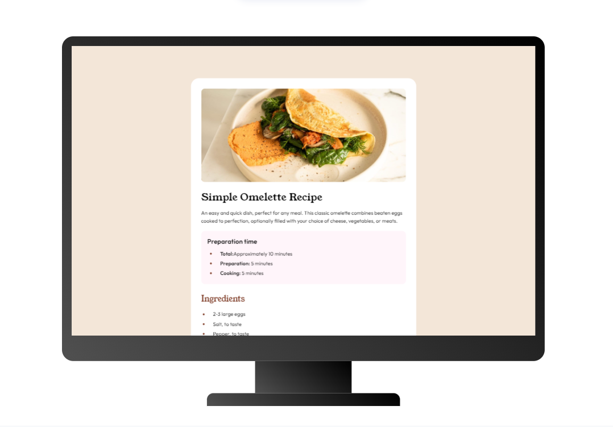
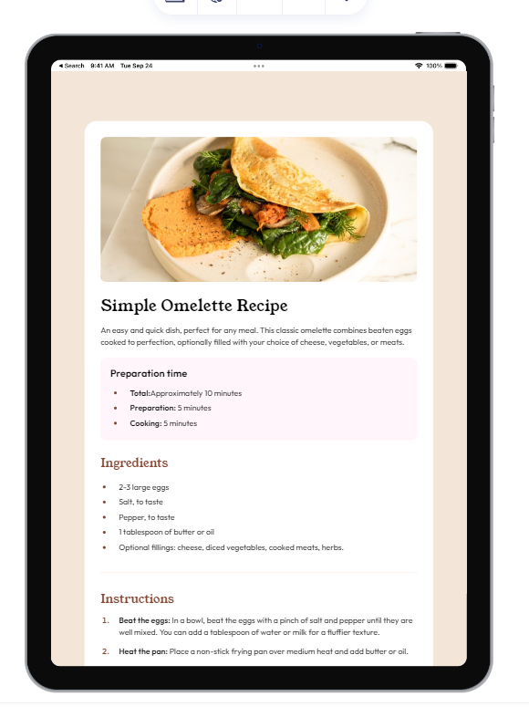
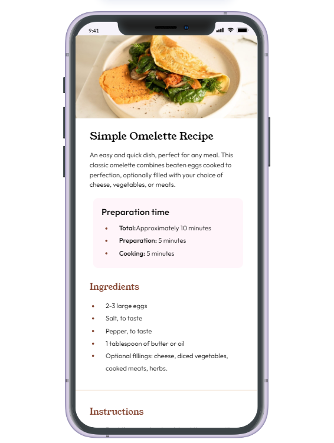

# Welcome!

This is a solution to the [Recipe page challenge on Frontend Mentor](https://www.frontendmentor.io/challenges/recipe-page-KiTsR8QQKm). Frontend Mentor challenges help you improve your coding skills by building realistic projects. 

## Table of contents

- [Overview](#overview)
  * [The challenge](#the-challenge)
  * [Screenshot](#screenshot)
  * [Links](#links)
- [My process](#my-process)
  * [Built with](#built-with)
  * [Continued development](#continued-development)
  * [Useful resources](#useful-resources)
- [Author](#author)

## Overview

### The challenge
* Build out recipe page and get it looking as close to the design as possible.

* View the optimal layout for the app depending on their device's screen size.

### Screenshot

### Links

* Solution URL: 
* Live Site URL: 
* github profile: 

## My process

### Built with

* Semantic HTML5 markup
* SASS
* Flexbox
* Responsive media queries

### Continued development

will complete more frontend mentor projects.

### Useful resources

* [Browser for web responsiveness on different devices](https://www.lambdatest.com/mobile-view-website) - this browser lets you test you website on diff phone, tab, laptop and desktop screen sizes.

* [Chatgpt](https://chat.openai.com/) - useful site when you get stuck in a project.

## Author

* Frontend Mentor - [markorrente01](https://www.frontendmentor.io/profile/markorrente01)